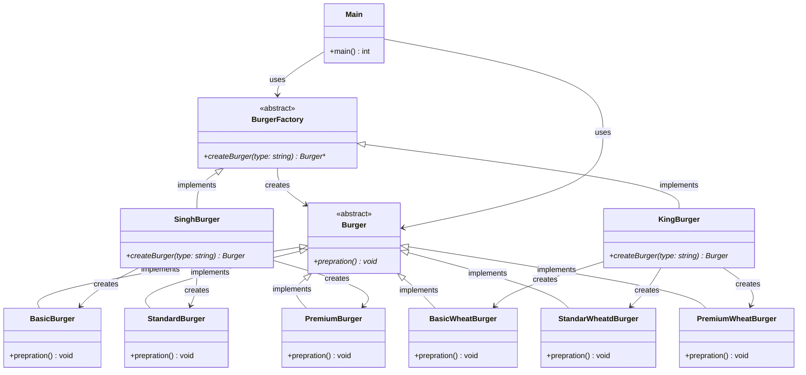

# Factory Method Pattern - UML Class Diagram

## Overview
The Factory Method pattern is a creational design pattern that provides an interface for creating objects in a superclass, but allows subclasses to alter the type of objects that will be created. It's more flexible than Simple Factory as it uses inheritance and polymorphism.

## UML Class Diagram



## Pattern Components

### 1. Product Interface (Burger)
- **Purpose**: Defines the interface for objects the factory creates
- **Role**: Abstract base class that all concrete products inherit from
- **Key Method**: `prepration()` - abstract method that must be implemented by concrete classes

### 2. Concrete Products
- **Regular Burgers**: `BasicBurger`, `StandardBurger`, `PremiumBurger`
- **Wheat Burgers**: `BasicWheatBurger`, `StandarWheatdBurger`, `PremiumWheatBurger`
- **Purpose**: Implement the product interface with specific behavior
- **Role**: Concrete classes representing different types and variants of burgers

### 3. Creator Interface (BurgerFactory)
- **Purpose**: Declares the factory method that returns product objects
- **Role**: Abstract base class that defines the interface for creating products
- **Key Method**: `createBurger()` - abstract factory method that subclasses must implement

### 4. Concrete Creators
- **SinghBurger**: Creates regular burger variants (Basic, Standard, Premium)
- **KingBurger**: Creates wheat burger variants (BasicWheat, StandardWheat, PremiumWheat)
- **Purpose**: Implement the factory method to create specific product variants
- **Role**: Concrete factory classes that determine which concrete product to create

### 5. Client (Main)
- **Purpose**: Uses the factory to create objects
- **Role**: Requests objects through the factory interface without knowing concrete classes
- **Key Method**: `main()` - demonstrates the usage of the factory method pattern

## Key Differences from Simple Factory

1. **Inheritance-based**: Uses abstract factory class with concrete implementations
2. **Polymorphism**: Client code works with factory interface, not concrete factories
3. **Extensibility**: Easy to add new factory types without modifying existing code
4. **Separation of Concerns**: Each concrete factory is responsible for its own product family

## Benefits of Factory Method Pattern

1. **Open/Closed Principle**: Open for extension, closed for modification
2. **Single Responsibility**: Each concrete factory handles one product family
3. **Polymorphism**: Client code depends on abstractions, not concrete classes
4. **Flexibility**: Different factories can create different variants of the same product type
5. **Maintainability**: Changes to one product family don't affect others

## Usage Example

```cpp
// Client code works with factory interface
BurgerFactory* factory = new KingBurger();  // or new SinghBurger()
Burger* burger = factory->createBurger("premium");
burger->prepration(); // Calls appropriate wheat burger preparation
```

## Product Families

- **SinghBurger Family**: Regular burgers (Basic, Standard, Premium)
- **KingBurger Family**: Wheat burgers (BasicWheat, StandardWheat, PremiumWheat)

Each family provides the same interface but with different implementations, allowing for easy switching between product variants.
