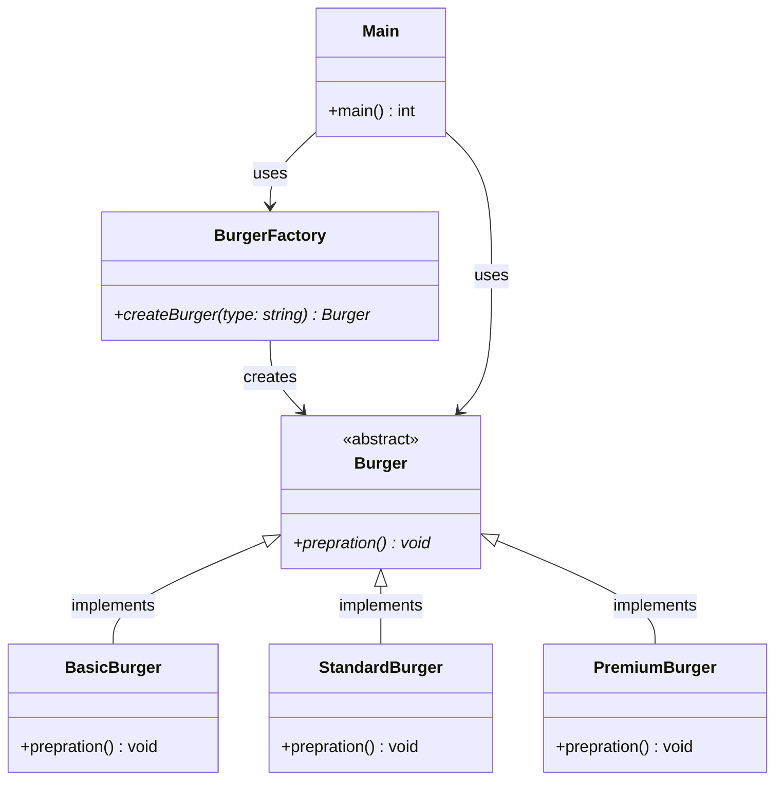

# Simple Factory Pattern - UML Class Diagram

## Overview
The Simple Factory pattern is a creational design pattern that provides a way to create objects without specifying their exact class. It encapsulates object creation logic in a factory class.

## UML Class Diagram



## Pattern Components

### 1. Product Interface (Burger)
- **Purpose**: Defines the interface for objects the factory creates
- **Role**: Abstract base class that all concrete products inherit from
- **Key Method**: `prepration()` - abstract method that must be implemented by concrete classes

### 2. Concrete Products (BasicBurger, StandardBurger, PremiumBurger)
- **Purpose**: Implement the product interface with specific behavior
- **Role**: Concrete classes that represent different types of burgers
- **Key Method**: `prepration()` - provides specific implementation for each burger type

### 3. Factory Class (BurgerFactory)
- **Purpose**: Encapsulates object creation logic
- **Role**: Contains a method to create and return appropriate product instances
- **Key Method**: `createBurger()` - factory method that creates objects based on input parameter

### 4. Client (Main)
- **Purpose**: Uses the factory to create objects
- **Role**: Requests objects from the factory without knowing the specific concrete class
- **Key Method**: `main()` - demonstrates the usage of the factory pattern

## Benefits of Simple Factory Pattern

1. **Encapsulation**: Object creation logic is centralized in the factory
2. **Flexibility**: Easy to add new product types without changing client code
3. **Separation of Concerns**: Client code doesn't need to know about concrete classes
4. **Maintainability**: Changes to object creation logic only affect the factory class

## Usage Example

```cpp
// Client code doesn't need to know about concrete classes
BurgerFactory* factory = new BurgerFactory();
Burger* burger = factory->createBurger("premium");
burger->prepration(); // Calls PremiumBurger::prepration()
```
