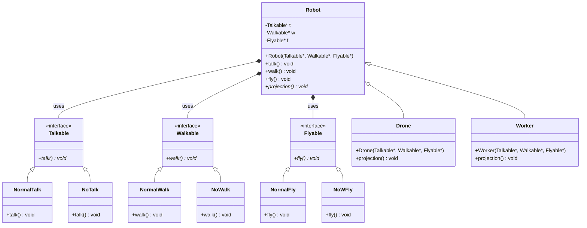

# Robot Simulation Design - UML Class Diagram

## Class Structure Analysis

This design implements the **Strategy Pattern** with **Composition** to create flexible robot behaviors. The design separates concerns by making different capabilities (talk, walk, fly) into separate strategy interfaces.

## UML Class Diagram



## Design Patterns Used

### 1. Strategy Pattern
- **Talkable**, **Walkable**, and **Flyable** are strategy interfaces
- Concrete implementations like **NormalTalk**, **NoTalk**, **NormalWalk**, etc. are concrete strategies
- The **Robot** class uses these strategies to define its behavior

### 2. Composition over Inheritance
- **Robot** class contains pointers to strategy objects rather than inheriting behavior
- This allows for runtime behavior changes and better flexibility

### 3. Template Method Pattern
- **Robot** class defines the template for robot behavior
- Concrete robot types (**Drone**, **Worker**) implement the abstract `projection()` method

## Key Design Benefits

1. **Flexibility**: Different robot types can have different combinations of capabilities
2. **Extensibility**: Easy to add new behaviors or robot types
3. **Maintainability**: Each behavior is isolated in its own class
4. **Runtime Configuration**: Robot capabilities can be changed at runtime

## Example Usage

```cpp
// Drone: Can't talk, can't walk, can fly
Robot* drone = new Drone(new NoTalk(), new NoWalk(), new NormalFly());

// Worker: Can talk, can walk, can't fly  
Robot* worker = new Worker(new NormalTalk(), new NormalWalk(), new NoWFly());
```

## Class Responsibilities

- **Strategy Interfaces**: Define contracts for specific behaviors
- **Concrete Strategies**: Implement specific behavior variations
- **Robot**: Orchestrates behaviors using composition
- **Concrete Robot Types**: Define robot-specific characteristics through the `projection()` method
