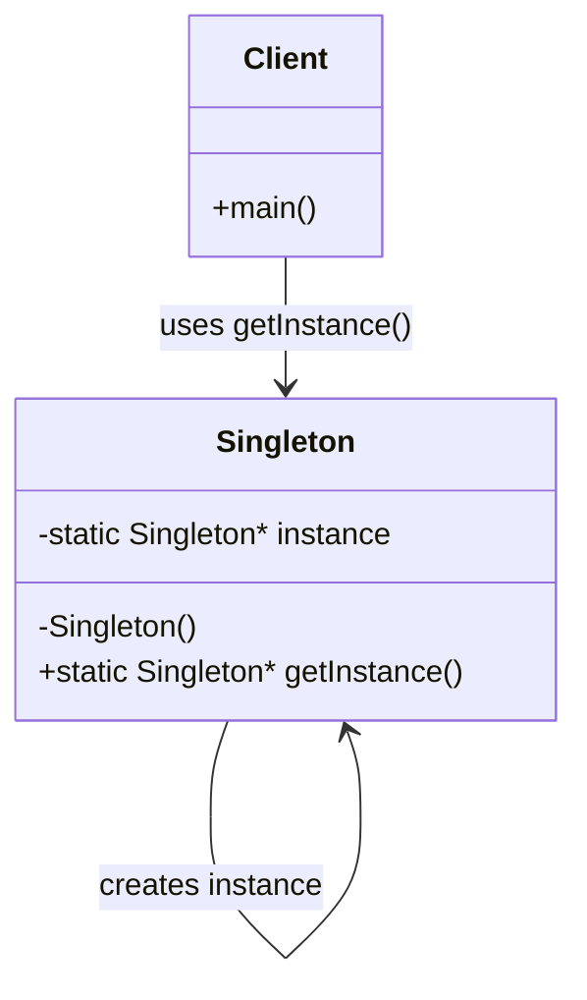

# Singleton Design Pattern - UML Diagram

## UML Class Diagram

## Class Diagram Explanation

### Singleton Class
- **Private static member**: `instance` - holds the single instance of the class
- **Private constructor**: `Singleton()` - prevents external instantiation
- **Public static method**: `getInstance()` - provides access to the single instance

### Client Class
- **main()**: Demonstrates how to use the Singleton pattern
- **Uses**: Calls `Singleton::getInstance()` to get the singleton instance

## Key Relationships
1. **Self-reference**: Singleton class references itself through the static instance
2. **Client dependency**: Client depends on Singleton for object creation
3. **Encapsulation**: Private constructor ensures controlled instantiation
