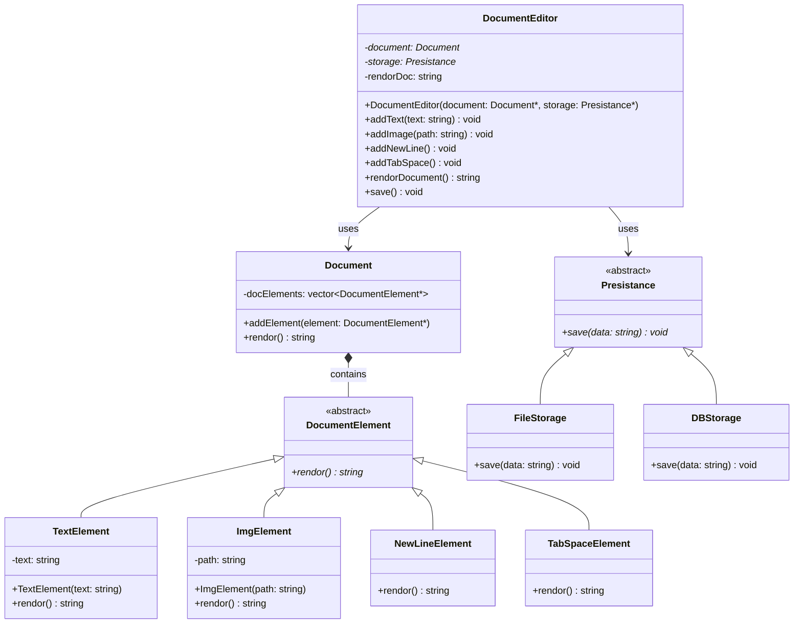

# UML Class Diagram for Text Editor with SOLID Principles

## Class Diagram

## Design Patterns and SOLID Principles Applied

### 1. **Strategy Pattern**
- `Presistance` interface with `FileStorage` and `DBStorage` implementations
- Allows switching between different storage strategies without changing client code

### 2. **Composite Pattern**
- `DocumentElement` as the component interface
- Various concrete elements (`TextElement`, `ImgElement`, etc.) as leaf components
- `Document` as the composite that manages a collection of elements

### 3. **SOLID Principles**

#### Single Responsibility Principle (SRP)
- Each class has a single, well-defined responsibility
- `TextElement` only handles text rendering
- `ImgElement` only handles image rendering
- `FileStorage` only handles file-based persistence

#### Open/Closed Principle (OCP)
- Classes are open for extension but closed for modification
- New document element types can be added without modifying existing code
- New storage types can be added without changing the editor

#### Liskov Substitution Principle (LSP)
- All `DocumentElement` subclasses can be used interchangeably
- All `Presistance` subclasses can be used interchangeably

#### Interface Segregation Principle (ISP)
- Interfaces are focused and specific
- `DocumentElement` has only the `rendor()` method
- `Presistance` has only the `save()` method

#### Dependency Inversion Principle (DIP)
- `DocumentEditor` depends on abstractions (`Document` and `Presistance`)
- Not dependent on concrete implementations

## Class Relationships

1. **Inheritance (IS-A)**
   - `TextElement`, `ImgElement`, `NewLineElement`, `TabSpaceElement` inherit from `DocumentElement`
   - `FileStorage`, `DBStorage` inherit from `Presistance`

2. **Composition (HAS-A)**
   - `Document` contains a collection of `DocumentElement` objects
   - `DocumentEditor` contains a `Document` and a `Presistance` object

3. **Dependency (USES-A)**
   - `DocumentEditor` uses `Document` and `Presistance` objects
   - `Document` uses `DocumentElement` objects for rendering

## Key Features

- **Polymorphic rendering**: All document elements implement the same `rendor()` interface
- **Flexible storage**: Can switch between file and database storage
- **Extensible design**: Easy to add new document element types
- **Separation of concerns**: Document structure, rendering, and persistence are separate
